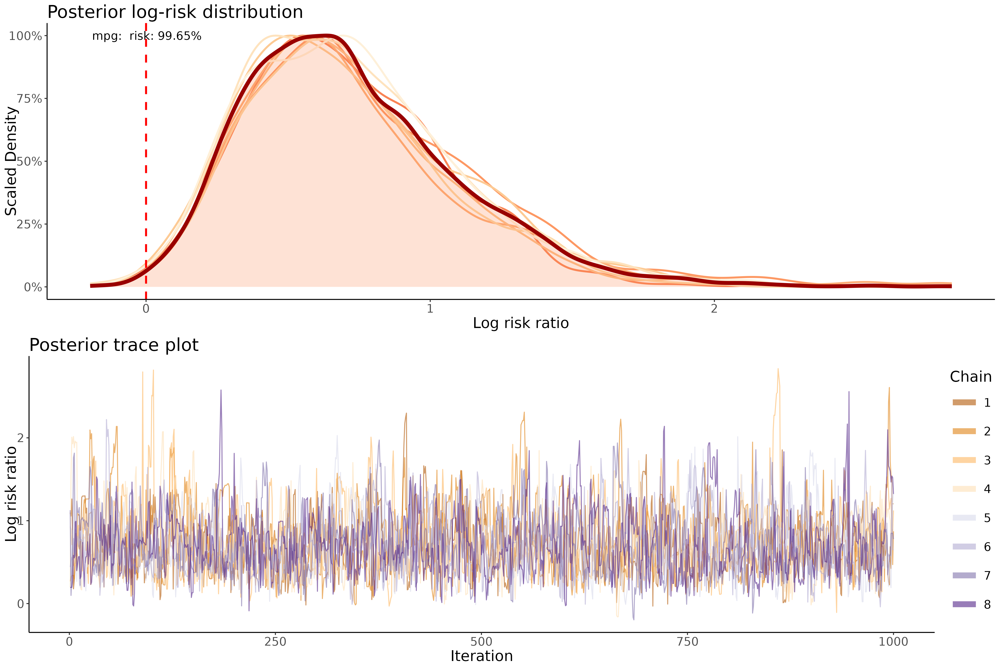

# bayer: Robust and Intuitive Bayesian Analysis in Clinical Studies

`bayer` is an R package crafted to enhance Bayesian statistical analysis in clinical research settings. Utilizing the robust capabilities of the `brms::brm()` function, `bayer` streamlines the application of Bayesian models for survival (Cox proportional hazards), logistic, linear, and multinomial analyses. This package is designed for statisticians and researchers who require powerful, yet user-friendly tools to manage complex datasets in medical studies.

## Key Features
- **Streamlined Bayesian Workflow**: Facilitates the use of Bayesian methods with configurations optimized for clinical studies.
- **Flexible Modeling**: Supports a variety of models including survival, logistic, linear, and multinomial regression.
- **Detailed Outputs**: Provides extensive reporting features, including summary statistics, diagnostics, and visualizations to ensure thorough understanding and evaluation of results.
- **Integration of Prior Knowledge**: Enhances model precision and relevance by incorporating existing expert insights and research findings.

## Advantages of Bayesian Analysis in Clinical Settings
Bayesian analysis is increasingly recognized in the field of clinical research for its comprehensive approach to statistical inference, particularly for its ability to incorporate prior knowledge. Here are some of the advantages:
- **Moving Beyond the 0.05 P-value**: Bayesian analysis provides probabilities of outcomes, offering insights into effects that might be overlooked by traditional significance testing.
- **Adaptive Analysis**: Allows for real-time data analysis in adaptive clinical trials, facilitating model adjustments based on interim data.
- **Improved Decision Making**: Delivers probabilities directly associated with hypotheses, aiding in clearer, more informed clinical decisions.
- **Effective with Small Samples**: Extremely useful in scenarios with limited data, where traditional methods might lack power.

## Easy Installation
Install `bayer` directly from GitHub:
```R
devtools::install_github("cccnrc/bayer")
```

## Usage Example
Below is an example of how to conduct a Bayesian logistic regression analysis using `bayer` on the R built-in dataset [mtcars](https://www.rdocumentation.org/packages/datasets/versions/3.6.2/topics/mtcars) which comes along R by default:
```R
# Load the library
library(bayer)

### import the built-in dataset mtcars
mtcars <- datasets::mtcars

### specify the treatment variable and the covariates you want to analyze
model_logistic <- bayer_logistic(
                      data = mtcars,
                      outcome = 'am',
                      covariates = c( 'mpg', 'cyl', 'vs', 'carb' )
                    )
```

## Catching posterior risk distribution and trace plots
`bayer` allows for easily visualization of posterior risk distribution to elucidate the specific effect of a variable of interest:
```R
posterior <- extract_posterior( model_logistic, var = 'mpg' )
```
This will generate an object(`posterior` in the example above) which contains:
- **data**: posterior draws of the specified model
- **risk_plot**: posterior log-risk distribution plot of the specified variable
- **trace_plot**: posterior trace distribution plot of the specified variable
- **combined_plot**: combined `risk_plot` and `trace_plot`:

These plots are needed in order to visualize model quality and the exact effects of a variable of interest in a Bayesian model. For more information take a look at [interpreting the posterior](https://stephens999.github.io/fiveMinuteStats/summarize_interpret_posterior.html) and [Monitoring Convergence](https://m-clark.github.io/bayesian-basics/diagnostics.html)

## Calculate Bayes Factor, WAIC and LOO
`bayer` allows for calculation of Bayes Factor, Watanabe-Akaike Information Criterion (WAIC), and Leave-One-Out Cross-Validation (LOO) to elucidate actual effect of a specific variable:
```R
bf <- get_bayes_factor( model_logistic, var = 'mpg' )
waic <- waic_analysis( model_logistic, var = 'mpg' )
loo <- loo_analysis( model_logistic, var = 'mpg'  )
```
`bf` contains the Bayesian Factor for the variable effect in the model. `waic` and `loo` are objects that contain mean WAIC and LOO difference (`mean`) with relative standard error (`se`) and p-value (`p`). `bf`, `waic`, and `loo` allows a precise analysis of how including the variable of interest in your model increase its quality, with relative statstical significance calculated.

## Easy IPTW implementation
`bayer` is made to handle [Inverse Probability of Treatment Weighting (IPTW)](https://github.com/cccnrc/riptw) and [weighted regression](https://towardsdatascience.com/weighted-linear-regression-2ef23b12a6d7) analysis.

Let's say we want to nullify covariates effect to focus on the actual effect of a treatment variable of interest `vs` of the `model_logistic` above.
```R
library(riptw)

### calculate standardized weights for the variable of interest ("vs") based on the rest of covariates
iptw_weight <- riptw( data = mtcars,
                      outcome = 'vs',
                      covariates = c( 'mpg', 'cyl', 'carb' )
                     )

### use IPTW weights in the Bayesian analysis
model_logistic_iptw <- bayer_logistic(
                          data = iptw_weight$data,
                          outcome = 'am',
                          covariates = 'vs',
                          weights = 'sw'
                        )

### plot and analyze model quality and variable of interest effect as in the example above
posterior_iptw <- extract_posterior( model_logistic_iptw, var = 'vs' )
bf_iptw <- get_bayes_factor( model_logistic_iptw, var = 'vs' )
waic_iptw <- waic_analysis( model_logistic_iptw, var = 'vs' )
loo_iptw <- loo_analysis( model_logistic_iptw, var = 'vs'  )
```
`bayer` is built to be easily paired with [riptw](https://github.com/cccnrc/riptw), an R package that allows easily IPTW analysis

## Multiple Regression Types
`bayer` supports:
- **linear** regression: with `bayer_linear()`
- **logistic** regression: with `bayer_logistic()`
- **logistic** regression: with `bayer_multinomial()`
- **Cox Proportonal Hazard Model** regression: with `bayer_coxph()`

# Customize bayer
`bayer` allows for a lot of more detailed analysis. Take a look at:
```
?bayer_linear
?bayer_logistic
?bayer_multinomial
?bayer_coxph
?extract_posterior
?get_bayes_factor
?waic_analysis
?loo_analysis
```
## Contributing
Contributions to `bayer` are more than welcomed!
